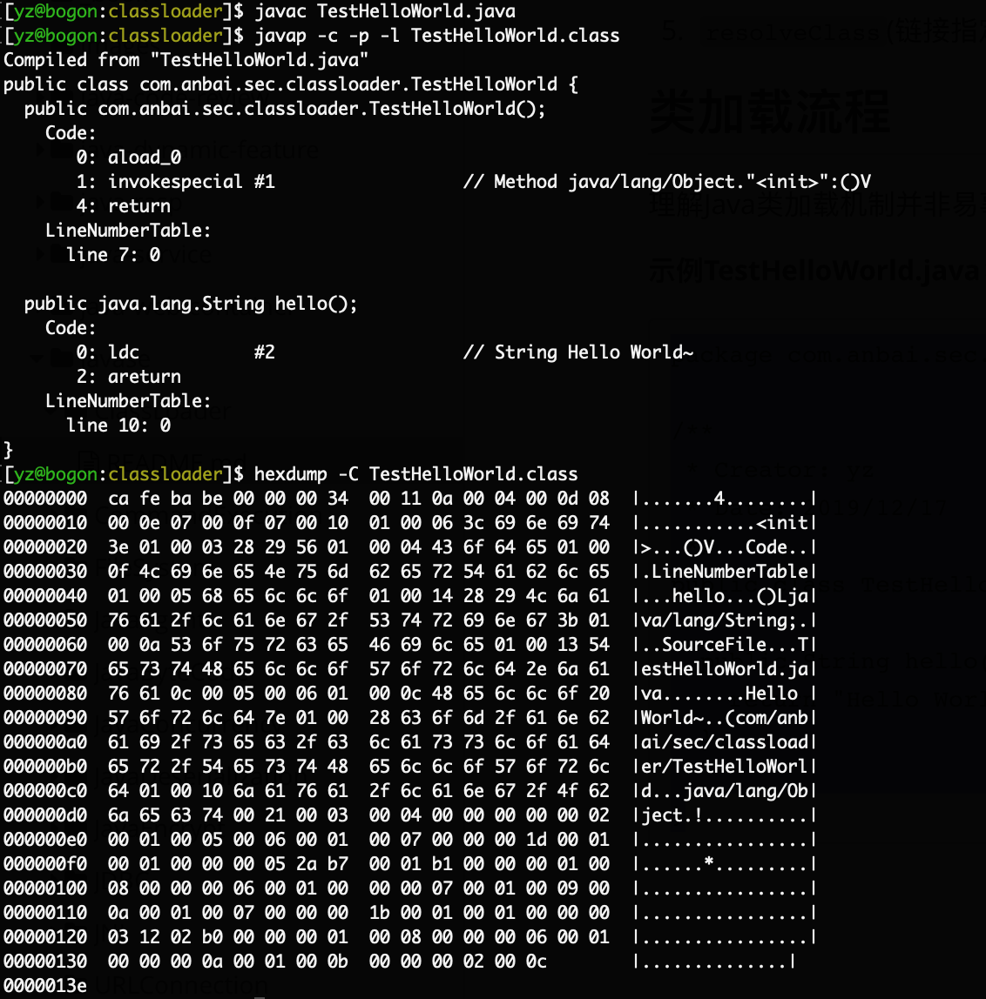

# ClassLoader(类加载机制)

Java是一个依赖于`JVM`(Java虚拟机)实现的跨平台的开发语言。Java程序在运行前需要先编译成`class文件`，Java类初始化的时候会调用`java.lang.ClassLoader`加载类字节码，`ClassLoader`会调用JVM的native方法(`defineClass0/1/2`)来定义一个`java.lang.Class`实例。

**JVM架构图：**


`ClassLoader`类有如下核心方法：

1. `loadClass`(加载指定的Java类)
2. `findClass`(查找指定的Java类)
3. `findLoadedClass`(查找JVM已经加载过的类)
4. `defineClass`(定义一个Java类)
5. `resolveClass`(链接指定的Java类)

## Java类动态加载方式

我们通常使用`Java反射`或者`ClassLoader`来动态加载一个类对象。

```java
// 反射加载TestHelloWorld示例
Class.forName("com.anbai.sec.classloader.TestHelloWorld");

// ClassLoader加载TestHelloWorld示例
this.getClass().getClassLoader().loadClass("com.anbai.sec.classloader.TestHelloWorld");
```

`Class.forName("类名")`默认会初始化被加载类的静态属性和方法，如果不希望初始化类可以使用`Class.forName("类名", 是否初始化类, 类加载器)`，而`ClassLoader.loadClass`默认不会初始化类方法。

## 类加载流程

理解Java类加载机制并非易事，这里我们以一个Java的HelloWorld来学习`ClassLoader`。

**示例TestHelloWorld.java：**

```java
package com.anbai.sec.classloader;

/**
 * Creator: yz
 * Date: 2019/12/17
 */
public class TestHelloWorld {

	public String hello() {
		return "Hello World~";
	}

}
```

编译`TestHelloWorld.java`：`javac TestHelloWorld.java`

通过javap命令反汇编`TestHelloWorld.class`文件对应的`com.anbai.sec.classloader.TestHelloWorld`类，以及使用hexdump命令查看`TestHelloWorld.class`文件二进制内容：



`ClassLoader`加载`com.anbai.sec.classloader.TestHelloWorld`类重要流程如下：

1. `ClassLoader`会调用`public Class<?> loadClass(String name)`方法加载`com.anbai.sec.classloader.TestHelloWorld`类。
2. 调用`findLoadedClass`方法检查`TestHelloWorld`类是否已经初始化，如果JVM已初始化过该类则直接返回类对象。
3. 如果创建当前`ClassLoader`时传入了父类加载器(`new ClassLoader(父类加载器)`)就使用父类加载器加载`TestHelloWorld`类，否则使用JVM的`Bootstrap ClassLoader`加载。
4. 如果上一步无法加载`TestHelloWorld`类，那么调用自身的`findClass`方法尝试加载`TestHelloWorld`类。
5. 如果当前的`ClassLoader`没有重写了`findClass`方法，那么直接返回类加载失败异常。如果当前类重写了`findClass`方法并通过传入的`com.anbai.sec.classloader.TestHelloWorld`类名找到了对应的类字节码，那么应该调用`defineClass`方法去JVM中注册该类。
6. 如果调用loadClass的时候传入的`resolve`参数为true，那么还需要调用`resolveClass`方法链接类,默认为false。
7. 返回一个被JVM加载后的`java.lang.Class`类对象。