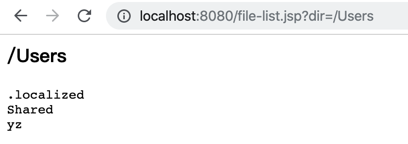
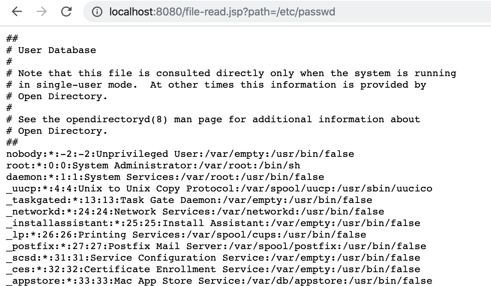

# Java 文件或目录恶意访问漏洞

本章节将讲解与Java文件或目录访问安全性问题。常见的Java文件操作相关的漏洞大致有如下类型：

1. 任意目录遍历
2. 任意文件、目录复制
3. 任意文件读取/下载
4. 任意文件、目录修改/重命名
5. 任意文件、目录删除
6. ......

我们通常把这类漏洞归为一个类型，因为产生漏洞的原因都是因为程序对文件或目录访问控制不严、程序内部逻辑错误导致的任意文件或目录恶意访问漏洞。

## Java 任意目录遍历漏洞

任意目录遍历漏洞顾名思义攻击者可以通过漏洞遍历出服务器操作系统中的任意目录文件名，从而导致服务器敏感信息泄漏，某些场景下(如遍历出网站日志、备份文件、管理后台等)甚至可能会导致服务器被非法入侵。

**Java 任意目录遍历漏洞示例代码:**

```java
<%@ page import="java.io.File" %><%--
  Created by IntelliJ IDEA.
  User: yz
  Date: 2019/12/4
  Time: 6:08 下午
  To change this template use File | Settings | File Templates.
--%>
<%@ page contentType="text/html;charset=UTF-8" language="java" %>
<%
    // 定义需要遍历的目录
    String dirStr = request.getParameter("dir");

    out.println("<h3>" + dirStr + "</h3>");

    if (dirStr != null) {
        File   dir  = new File(dirStr);
        File[] dirs = dir.listFiles();

        out.println("<pre>");

        for (File file : dirs) {
            out.println(file.getName());
        }

        out.println("</pre>");
    }

%>
```

当我们通过不断修改URL中的dir参数即可遍历出制定目录的任意文件，漏洞演示URL:http://localhost:8080/file-list.jsp?dir=/Users



这个漏洞可能由Web应用本身的开发不规范导致，也有可能是因为`MVC框架`、`项目依赖的第三方库`、`Web服务器自身`导致的。如果是由于自身开发不规范导致的那么需要程序严格控制用户传入目录参数是否合法！

**检测用户参数合法性代码示例(请根据具体业务需求调整判定逻辑):**

```java
<%@ page import="java.io.File" %><%--
  Created by IntelliJ IDEA.
  User: yz
  Date: 2019/12/4
  Time: 6:08 下午
  To change this template use File | Settings | File Templates.
--%>
<%@ page contentType="text/html;charset=UTF-8" language="java" %>
<%!
    // 定义限制用户遍历的文件目录常量
    private static final String IMAGE_DIR = "/data/images/";
%>
<%
    // 定义需要遍历的目录
    String dirStr = request.getParameter("dir");

    if (dirStr != null) {
        File dir = new File(dirStr);

        // 获取文件绝对路径，转换成标准的文件路径
        String fileDir = (dir.getAbsoluteFile().getCanonicalFile() + "/").replace("\\\\", "").replaceAll("/+", "/");
        out.println("<h3>" + fileDir + "</h3>");

        // 检查当前用户传入的目录是否包含在系统限定的目录下
        if (fileDir.startsWith(IMAGE_DIR)) {
            File[] dirs = dir.listFiles();

            out.println("<pre>");

            for (File file : dirs) {
                out.println(file.getName());
            }

            out.println("</pre>");
        } else {
            out.println("目录不合法!");
        }
    }

%>
```

请求遍历非系统限制的目录示例：


## 任意文件读取/编辑/删除漏洞

任意文件读写漏洞即因为没有验证请求的资源文件是否合法导致的，此类漏洞在Java中有着较高的几率出现，任意文件读取漏洞原理很简单，但是在这个问题上翻车的有不乏一些知名的中间件:`Weblogic`、`Tomcat`、`Resin`又或者是主流MVC框架:`Spring MVC`、`Struts2`。任意文件读写、下载的逻辑大致是一致的本节不再一一举例。

**任意文件读取示例代码file-read.jsp:**

```java
<%@ page contentType="text/html;charset=UTF-8" language="java" %>
<%@ page import="java.io.ByteArrayOutputStream" %>
<%@ page import="java.io.File" %>
<%@ page import="java.io.FileInputStream" %>

<%
    File file = new File(request.getParameter("path"));
    FileInputStream fis = new FileInputStream(file);
    ByteArrayOutputStream baos = new ByteArrayOutputStream();
    byte[] b = new byte[1024];
    int a = -1;

    while ((a = fis.read(b)) != -1) {
        baos.write(b, 0, a);
    }

    out.write("<pre>" + new String(baos.toByteArray()) + "</pre>");

    fis.close();
%>
```

任意文件读取测试:`http://localhost:8080/file-read.jsp?path=/etc/passwd`




**任意文件删除示例代码file-delete.jsp:**

```java
<%@ page contentType="text/html;charset=UTF-8" language="java" %>
<%@ page import="java.io.File" %>
<%
    String fileName = request.getParameter("file");

    if (fileName != null) {
        // 创建文件对象
        File file = new File(fileName);

        if (file.exists()) {
            file.delete();// 删除文件

            out.println(fileName + "删除成功!");
        } else {
            out.println("文件不存在!");
        }
    }
%>
```

任意文件删除测试：`http://localhost:8080/file-delete.jsp?file=/tmp/test.txt`


**任意文件读/写/删除漏洞修复**

修改方案主要是严格校验用户输入的文件名和目录是否合法，可参考本节的任意目录遍历漏洞修复方式。


##  Java 恶意文件访问审计建议

在审计文件读取功能的时候要非常仔细，或许很容易就会有意想不到的收获！快速发现这类漏洞得方式其实也是非常简单的，在IDEA中的项目中重点搜下如下文件读取的类。

1. **JDK原始的`java.io.FileInputStream`、`java.io.FileOutputStream`类**
2. **JDK原始的`java.io.RandomAccessFile`类**
3. **Apache Commons IO提供的`org.apache.commons.io.FileUtils`类**
4. JDK1.7新增的基于NIO非阻塞异步读取文件的`java.nio.channels.AsynchronousFileChannel`类。
5. JDK1.7新增的基于NIO读取文件的`java.nio.file.Files`类。常用方法如:`Files.readAllBytes`、`Files.readAllLines`
6. `java.io.File`类的`list`、`listFiles`、`listRoots`、`delete`方法。

如果仍没有什么发现可以搜索一下`FileUtil`很有可能用户会封装文件操作的工具类。

## Java 恶意文件访问总结

首先，在Java中任意文件或目录恶意访问漏洞是一种非常常见的高危漏洞！多是因为程序内部逻辑错误或者过于信任用户传入的参数导致的。其次此类漏洞原理简单在渗透测试或代码审计时非常容易发现且漏洞影响重大，因为攻击者可以直接操纵服务器中的文件或目录，所以在程序开发过程中我们应该高度重视编码规范、程序逻辑严谨性防止该漏洞发生。