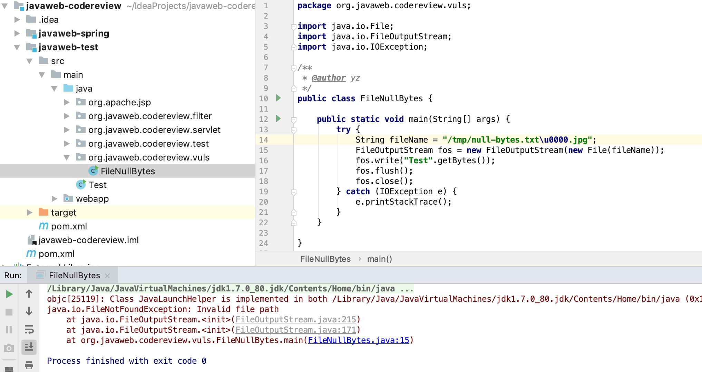

# Java 文件名空字节截断漏洞

空字节截断漏洞漏洞在诸多编程语言中都存在，究其根本是Java在调用文件系统(C实现)读写文件时导致的漏洞，并不是Java本身的安全问题。不过好在高版本的JDK在处理文件时已经把空字节文件名进行了安全检测处理。


## 文件名空字节漏洞历史

2013年9月10日发布的`Java SE 7 Update 40`修复了空字节截断这个历史遗留问题。此次更新在`java.io.File`类中添加了一个`isInvalid`方法，专门检测文件名中是否包含了空字节。

```java
/**
 * Check if the file has an invalid path. Currently, the inspection of
 * a file path is very limited, and it only covers Nul character check.
 * Returning true means the path is definitely invalid/garbage. But
 * returning false does not guarantee that the path is valid.
 *
 * @return true if the file path is invalid.
 */
 final boolean isInvalid() {
     if (status == null) {
         status = (this.path.indexOf('\u0000') < 0) ? PathStatus.CHECKED
                                                    : PathStatus.INVALID;
     }
     return status == PathStatus.INVALID;
 }
```

修复的JDK版本所有跟文件名相关的操作都调用了`isInvalid`方法检测，防止文件名空字节截断。


修复前(`Java SE 7 Update 25`)和修复后(`Java SE 7 Update 40`)的对比会发现`Java SE 7 Update 25`中的`java.io.File`类中并未添加`\u0000`的检测。


受空字节截断影响的JDK版本范围:`JDK<1.7.40`,单是JDK7于2011年07月28日发布至2013年09月10日发表`Java SE 7 Update 40`这两年多期间受影响的就有16个版本，值得注意的是JDK1.6虽然JDK7修复之后发布了数十个版本，但是并没有任何一个版本修复过这个问题，而JDK8发布时间在JDK7修复以后所以并不受此漏洞影响。

参考:

1. [JDK-8014846 : File and other classes in java.io do not handle embedded nulls properly](https://bugs.java.com/bugdatabase/view_bug.do?bug_id=8014846)。
2. [维基百科-Java版本歷史](https://zh.wikipedia.org/wiki/Java版本歷史)
3. [Oracle Java 历史版本下载](https://www.oracle.com/technetwork/java/javase/archive-139210.html)


## Java文件名空截断测试

测试类`FileNullBytes.java`:

```java
package com.anbai.sec.filesystem;

import java.io.File;
import java.io.FileOutputStream;
import java.io.IOException;

/**
 * @author yz
 */
public class FileNullBytes {

	public static void main(String[] args) {
		try {
			String           fileName = "/tmp/null-bytes.txt\u0000.jpg";
			FileOutputStream fos      = new FileOutputStream(new File(fileName));
			fos.write("Test".getBytes());
			fos.flush();
			fos.close();
		} catch (IOException e) {
			e.printStackTrace();
		}
	}

}
```

使用`JDK1.7.0.25`测试成功截断文件名：


使用`JDK1.7.0.80`测试写文件截断时抛出`java.io.FileNotFoundException: Invalid file path`异常:




## 空字节截断利用场景

Java空字节截断利用场景最常见的利用场景就是`文件上传`时后端获取文件名后使用了`endWith`、正则使用如:`.(jpg|png|gif)$`验证文件名后缀合法性且文件名最终原样保存,同理文件删除(`delete`)、获取文件路径(`getCanonicalPath`)、创建文件(`createNewFile`)、文件重命名(`renameTo`)等方法也可适用。


## 空字节截断修复方案

最简单直接的方式就是升级JDK，如果担心升级JDK出现兼容性问题可在文件操作时检测下文件名中是否包含空字节，如JDK的修复方式:`fileName.indexOf('\u0000')`即可。