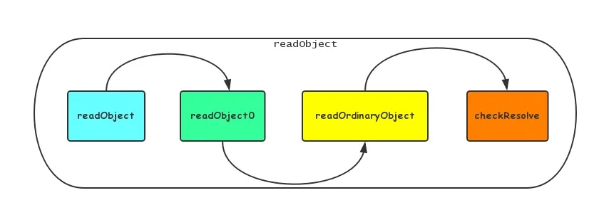
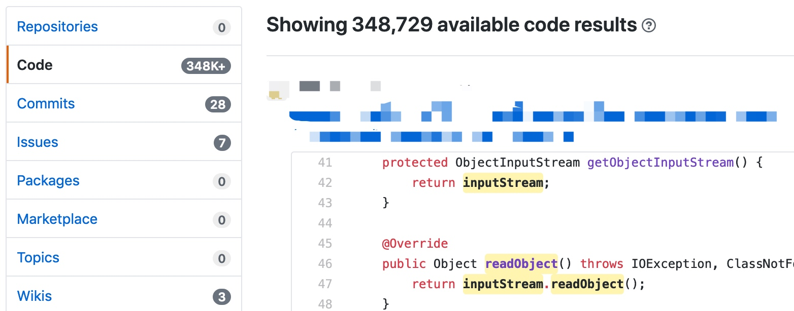
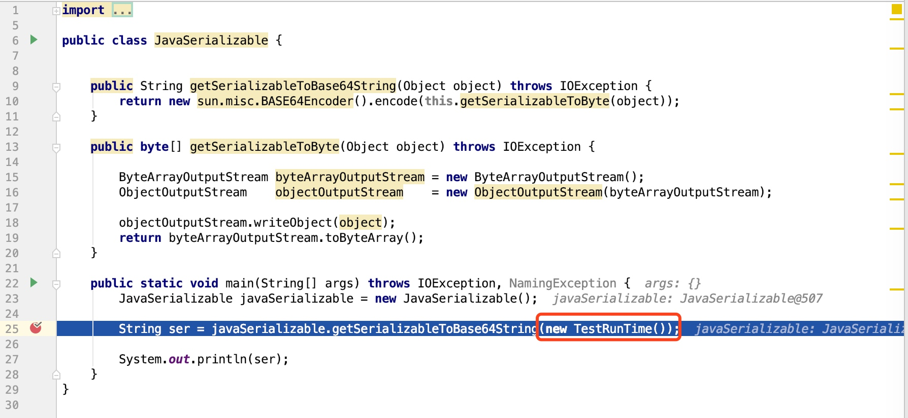
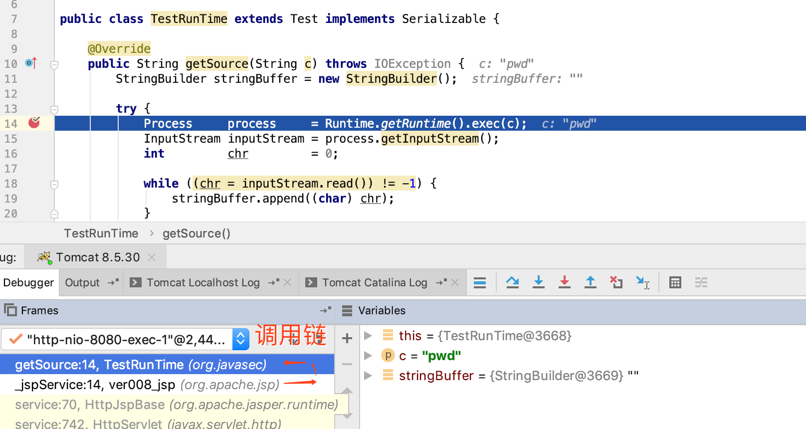

# Java 序列化与反序列化

Java为了方便开发人员将Java对象进行序列化及反序列化提供了一套方便的API来支持。其中包括以下接口和类：


```java
java.io.Serializable 
java.io.Externalizable 
ObjectOutput
ObjectInput
ObjectOutputStream
ObjectInputStream
```

**ObjectOutput**和**ObjectInput**接口

**ObjectInput**接口扩展自`DataInput`接口以包含对象的读操作。
`DataInput` 接口用于从二进制流中读取字节，并根据所有 Java 基本类型数据进行重构。同时还提供根据 `UTF-8` 修改版格式的数据重构 `String` 的工具。

**ObjectOutput**接口扩展自`DataOutput`接口以包含对象的写入操作。

`DataOutput` 接口用于将数据从任意 Java 基本类型转换为一系列字节，并将这些字节写入二进制流。同时还提供了一个将 `String` 转换成 `UTF-8` 修改版格式并写入所得到的系列字节的工具。

**ObjectOutputStream**类和**ObjectInputStream**类

通过前面的代码片段中我们也能知道，我们一般使用`ObjectOutputStream`的`writeObject`方法把一个对象进行持久化。再使用`ObjectInputStream`的`readObject`从持久化存储中把对象读取出来。


## 0x01. Java 序列化代码

**Java 序列化Demo对象代码**

**Demo**的作用是，展示通过序列化结果进行网络数据传输，通过反序列化操作进行Java代码执行。

以下 `TestSerializable` 为一个 `Serializable` 接口的实现类，其定义了两个方法，一个是构造方法`TestSerializable`，一个是普通方法`print`。
这个实现类的功能在于 `print` 方法，`print`方法可传入一个用于命令行执行的字符串，使用`Runtime.getRuntime().exec` 执行，然后将执行结果返回。

```java
// TestSerializable.java
import java.io.IOException;
import java.io.InputStream;
import java.io.Serializable;

public class TestSerializable implements Serializable {

	TestSerializable() {}

	public String print(String str) throws IOException {
		StringBuffer stringBuffer = new StringBuffer();

		Process     process     = Runtime.getRuntime().exec(str);
		InputStream inputStream = process.getInputStream();
		int         chr         = 0;

		while ((chr = inputStream.read()) != -1) {
			stringBuffer.append((char) chr);
		}

		return stringBuffer.toString();
	}

	// ......其他条件代码
}
```

**Java 序列化示例代码:**

由于网上大部分都是将序列化结果保存在了文件，有朋友不懂如何获取字节码数据，然后就写了一个直接获取Base64编码后的序列化数据，通过使用`getSerializableToBase64String`方法传入待序列化的对象，返回序列化对象的Base64编码后的结果

```java
// JavaSerializable.java
import java.io.*;

public class JavaSerializable {

	public String getSerializableToBase64String(Object object) throws IOException {
		return new sun.misc.BASE64Encoder().encode(this.getSerializableToByte(object));
	}

	public byte[] getSerializableToByte(Object object) throws IOException {

		ByteArrayOutputStream byteArrayOutputStream = new ByteArrayOutputStream();
		ObjectOutputStream    objectOutputStream    = new ObjectOutputStream(byteArrayOutputStream);

		objectOutputStream.writeObject(object);
		return byteArrayOutputStream.toByteArray();
	}

	public static void main(String[] args) throws IOException {
		JavaSerializable javaSerializable = new JavaSerializable();

		String serStr = javaSerializable.getSerializableToBase64String(new TestSerializable());

		System.out.println(serStr);
	}
}
```

执行 `JavaSerializable.main` 以后，输出序列化后 `TestSerializable` 对象的Base64编码的结果（同样的代码,不同的JDK出来的结果可能不一样）


```
rO0ABXNyABBUZXN0U2VyaWFsaXphYmxl6vCgfrE2SbgCAAB4cA==
```

## 0x02. Java 反序列化代码

上面我们将对象序列化以后编码成了Base64编码，使用`getUnSerializableObject`方法将`TestSerializable`实现类通过反序列化进行对象还原。

**Java 反序列化示例代码:**

```java
import java.io.*;

public class JavaUnSerializable {

	public Object getUnSerializableObject(String base64) throws IOException, ClassNotFoundException {
		byte[] objectByte = new sun.misc.BASE64Decoder().decodeBuffer(base64);
		return this.getUnSerializableObject(objectByte);
	}

	public Object getUnSerializableObject(byte[] objectByte) throws ClassNotFoundException, IOException {

		ByteArrayInputStream byteArrayInputStream = new ByteArrayInputStream(objectByte);
		ObjectInputStream    objectInputStream    = new ObjectInputStream(byteArrayInputStream);

		return objectInputStream.readObject();
	}

	public static void main(String[] args) throws IOException, ClassNotFoundException {
		JavaUnSerializable javaUnSerializable = new JavaUnSerializable();

	   TestSerializable testSer= javaUnSerializable.getUnSerializableObject("rO0ABXNyABBUZXN0U2VyaWFsaXphYmxl6vCgfrE2SbgCAAB4cA==");
		testSer.print("ls");
	}
}
```

这里源码中关键是以下部分：

```java
ByteArrayInputStream byteArrayInputStream = new ByteArrayInputStream(objectByte);
ObjectInputStream    objectInputStream    = new ObjectInputStream(byteArrayInputStream);
return objectInputStream.readObject();
```

先将待反序列化的字节数组，存放在字节数组流中，然后将字节数组流转换为对象输入流，通过对象输入流`readObject` 方法进行对象反序列化，`readObject` 方法执行链如下:




 `TestSerializable` 实现类被反序列化以后，是需要有个同类型变量实例接收的，即如下：

```
TestSerializable testSer = (TestSerializable) objectInputStream.readObject()
```

开发常规编写java反序列化代码如下:





如果没有对反序列化的数据来源加以控制，将会触发`java反序列化漏洞`。

## 0x03. Java 反序列化在Servlte(JSP)中的使用

#### 1. JSP接收序列化数据进行处理及调用

用于接收反序列化数据并执行，传入java序列化后数据进行反序列化调用

```java
// ver.jsp
<%@ page import="java.io.*" %>
<%@ page import="org.javasec.Test" %>

<%
    // 获取序列化数据 
    String ser = request.getParameter("ser");
    // 获取待执行命令
    String cmd = request.getParameter("cmd");
		// Base64解码操作
    byte[] objectByte = new sun.misc.BASE64Decoder().decodeBuffer(ser);
    ByteArrayInputStream byteArrayInputStream = new ByteArrayInputStream(objectByte);
    ObjectInputStream objectInputStream = new ObjectInputStream(byteArrayInputStream);
    // 反序列化操作
		Test test = (Test) objectInputStream.readObject();
		// 利用父类方法调用子类重写方法
    out.println(test.getSource(cmd));
%>
```

构建一个`TestRunTime`用于可以用于序列化进行传输的实体类，首先继承 `Test` 类，并重写`Test`类的`getSource`方法，更改方法体的代码，再实现`Serializable`接口，使其能够被序列化。

```java
// Test.java
package org.javasec;

import java.io.IOException;

public class Test {
   public String getSource(String c) throws IOException {
      return c;
   }
}
```

```java
// TestRunTime.java
package org.javasec;

import java.io.IOException;
import java.io.InputStream;
import java.io.Serializable;

public class TestRunTime extends Test implements Serializable {

	@Override
	public String getSource(String c) throws IOException {
		StringBuilder stringBuffer = new StringBuilder();

		try {
			Process     process     = Runtime.getRuntime().exec(c);
			InputStream inputStream = process.getInputStream();
			int         chr         = 0;

			while ((chr = inputStream.read()) != -1) {
				stringBuffer.append((char) chr);
			}
		} catch (IOException ignored) {
		}
		return stringBuffer.toString();
	}
}

```

代码都准备好了，整理下流程：

1. 生成`TestRunTime`序列化数据
2. 传递序列化数据给`Servlte(JSP)->ver.jsp`
3. 查看`ver.jsp`执行结果

**1. 生成`TestRunTime`序列化数据**

通过文章开头讲的序列化知识，来生成一个`TestRunTime`序列化后的字节码数组，但由于字节码数组不是文本，不方便用于传输，我们可以将字节码数组转为Base64编码。

```java
// JavaSerializable.java
import java.io.*;

public class JavaSerializable {

	public String getSerializableToBase64String(Object object) throws IOException {
		return new sun.misc.BASE64Encoder().encode(this.getSerializableToByte(object));
	}

	public byte[] getSerializableToByte(Object object) throws IOException {

		ByteArrayOutputStream byteArrayOutputStream = new ByteArrayOutputStream();
		ObjectOutputStream    objectOutputStream    = new ObjectOutputStream(byteArrayOutputStream);

		objectOutputStream.writeObject(object);
		return byteArrayOutputStream.toByteArray();
	}

	public static void main(String[] args) throws IOException {
		JavaSerializable javaSerializable = new JavaSerializable();

		String serStr = javaSerializable.getSerializableToBase64String(new TestRunTime());

		System.out.println(serStr);
	}
}
```



通过Base64编码得到，如下`TestRunTime`类序列化后的结果:

```
rO0ABXNyAAtUZXN0UnVuVGltZUFRkUnGiDr6AgAAeHA=
```

**2. 传递序列化数据给`Servlte(JSP)`**

将生成好的序列化数据传递给`Servlte(JSP)`，也就是`ver.jsp`文件(园长常说的一切`jsp`都是`Servlte`)，

1. 通过`request.getParameter("ser")`，接收客户端传入参数`ser`的值；
2. 通过`sun.misc.BASE64Decoder().decodeBuffer` 解码还原序列化后的字节码数组；
3. 使用 `Test user = (Test) objectInputStream.readObject()`将序列化后的数据进行反序列化，得到`Test`对象；
4. 调用`Test.getSource`重写后的方法`TestRunTime.getSource`，执行自定义代码，这时`TestRunTime.getSource` 方法体的内容是存在内存中的


继续跟进`test.getSource(cmd)` ，可以看到`getSource`实际是调用的子类`TestRunTime`的方法



**3.查看`ver.jsp`执行结果**

可以看到通过反序列化的类`TestRunTime`调用


#### 2. 使用系统类继承调用

由于很多原因，我们没办法再一个系统中定义一个我们自己的类，在这种情况下可以使用JVM中的类来继承

用于执行反序列化后的类，同样需要重写父类某一方法，并进行调用

```java
// TestSer.java
import javax.naming.InitialContext;
import javax.naming.NamingException;
import java.io.IOException;
import java.io.InputStream;
import java.io.Serializable;

public class TestSer extends InitialContext implements Serializable {

   TestSer() throws NamingException {
      super(true);
   }

   @Override
   public String composeName(String str, String code) {
      StringBuilder stringBuffer = new StringBuilder();

      try {
         Process     process     = Runtime.getRuntime().exec(str);
         InputStream inputStream = process.getInputStream();
         int         chr         = 0;

         while ((chr = inputStream.read()) != -1) {
            stringBuffer.append((char) chr);
         }
      } catch (IOException ignored) {
      }

      return stringBuffer.toString();
   }

   // ......其他条件代码
}
```

调用执行的jsp代码

```java
// ver.jsp
<%@ page import="java.io.*" %>
<%@ page import="javax.naming.InitialContext" %>

<%

    String ser = request.getParameter("ser");
    String cmd = request.getParameter("cmd");

    byte[] objectByte = new sun.misc.BASE64Decoder().decodeBuffer(ser);
    ByteArrayInputStream byteArrayInputStream = new ByteArrayInputStream(objectByte);
    ObjectInputStream objectInputStream = new ObjectInputStream(byteArrayInputStream);

    InitialContext initialContext = (InitialContext) objectInputStream.readObject();
    out.print(initialContext.composeName(cmd,""));
%>
```

执行结果


## 0x04. java序列化漏洞


## 参考

Java序列化与反序列化: https://www.jianshu.com/p/d5d36670e1b2

